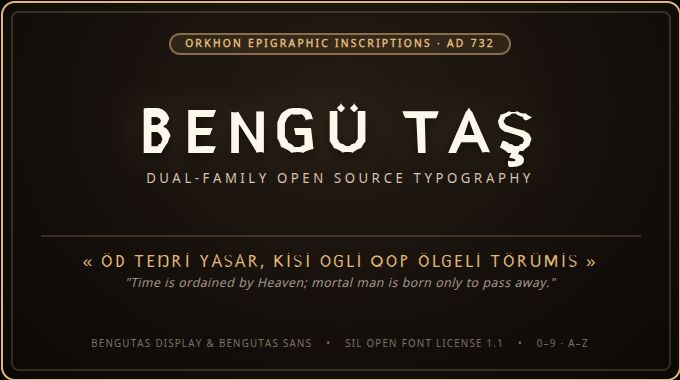

# Bengü Taş (Bengutas)

<p align="center">
  
</p>

<p align="center">
  <a href="https://opensource.org/licenses/OFL-1.1"></a>
  <a href="https://enisn.github.io/bengutas/"></a>
  <a href="#formats"></a>
  <a href="#weights"></a>
</p>

**Bengü Taş** (*Bengutas*) is an open-source, dual-family typographic system inspired by the 8th-century epigraphic stone inscriptions of the Orkhon Valley. It translates the severe, non-curvilinear chisel geometry of ancient Eurasian stelae into a refined modern Latin typeface.

> *Öd Teŋri yasar, kisi ogli qop ölgeli törümis.*  
> *"Time is ordained by Heaven; mortal man is born only to pass away."*  
> — **Kül Tigin Stela (AD 732)**

---

## 🏛️ Live Specimen & Interactive Tester

An interactive type specimen with live font switching, variable size controls, and full character maps is available at:  
👉 **[https://enisn.github.io/bengutas/](https://enisn.github.io/bengutas/)**

---

## 📐 The Dual-Family System

Bengutas is built as a complementary two-part system designed for contrasting editorial and display applications:

| Family | Classification | Intended Use | Distinctive Traits |
| :--- | :--- | :--- | :--- |
| **Bengutas Display** | Epigraphic Lapidary | Titles, Headers, Posters, Identity | Strictly non-curvilinear; all curved forms are chiseled with 45°/60° stone chamfers. Includes automatic petite small-caps for lowercase input. |
| **Bengutas Sans** | Contemporary Grotesque | Body Copy, UI, Editorial, Descriptions | Clean, neutral proportions with optimal legibility across small text sizes and screen environments. |

---

## 🔍 Design Philosophy

Ancient monument carvers working on hard basalt and granite stelae could not score freehand compass curves into stone. Instead, lines were struck with bronze and iron chisels in deliberate, faceted planes.

**Bengutas Display** honors this epigraphic logic:
* **Faceted Basalt Geometry:** Rounded letters (`O`, `C`, `D`, `G`, `U`, `B`, `P`) are sculpted as octagonal, chiseled stone rings rather than mechanical ellipses.
* **Chevron & Dagger Junctions:** Diagonals meet stems at sharp, incised stone-cut angles.
* **Petite Small-Caps:** In line with ancient monumental tradition, lowercase letters render as scaled, balanced majuscules.

---

## 🗿 Why "Bengü Taş"? (The Eternal Stone)

In Old Turkic, the phrase is inscribed in the Orkhon runic script as **𐰋𐰭𐰇 𐱃𐱁** (*beŋü taş* or *meŋgü taş*):
* **Bengü / Meŋü:** *Eternal, everlasting, immortal, perpetual.*
* **Taş:** *Stone, rock, monument.*
* **Literal Translation:** **"The Eternal Stone"** or **"Monument of Eternity."**

### Historical Significance
In the 8th century (Second Turkic Khaganate, c. AD 720–735), the Göktürks erected towering basalt and granite stelae in the Orkhon Valley of modern-day Mongolia to commemorate their leaders—most notably **Bilge Khagan**, prince **Kül Tigin**, and grand chancellor **Tonyukuk**.

In these inscriptions, the rulers explicitly referred to their carved stelae as **Bengü Taş**:
> *« ...men bökelerig bengü taş toqıtdım... »*  
> *"I had an eternal stone carved so that the memory would not perish."*

This was grounded in a poignant philosophical understanding of mortality: human life and dynasties are ephemeral, but words struck into enduring stone survive across millennia to advise and guide future generations:
> *Öd Teŋri yasar, kisi ogli qop ölgeli törümis.*  
> *"Time is ordained by Heaven; mortal man is born only to pass away."*  
> — **Kül Tigin Stela (AD 732)**

### Modern Typographic Vision
This project names the typeface **Bengü Taş** to bridge that 1,300-year-old epigraphic philosophy with modern digital typography:
1. **Stone Materiality:** The non-curvilinear, faceted 45° and 60° chisel cuts mirror the physical reality of carving granite and basalt without compasses.
2. **Damga Heritage:** The geometry preserves structural resonances with ancient Eurasian tamgas (clan brands) and runic letters.
3. **Open-Source Permanence:** Released under the SIL Open Font License 1.1, the font is an enduring, freely accessible cultural artifact—a modern digital *Bengü Taş* for games, literature, and visual design.

---

## 📂 Repository Structure

```
bengutas/
├── dist/                 # Ready-to-use production binaries
│   ├── ttf/              # TrueType format (.ttf)
│   ├── otf/              # OpenType format (.otf)
│   └── web/              # Web formats (.woff, .woff2)
├── docs/                 # Interactive specimen hosted via GitHub Pages (index.html)
│   ├── banner.png        # Typographic hero banner
│   └── index.html        # Live web tester
├── src/                  # Build toolchain and vector datasets
│   ├── build.py          # FontForge build script
│   ├── regular_glyphs.json
│   └── bold_glyphs.json
├── LICENSE               # SIL Open Font License 1.1
└── README.md
```

---

## 📦 Installation & Usage

### Desktop (macOS, Windows, Linux)
Download the `.ttf` or `.otf` files from `dist/ttf/` or `dist/otf/` and install them via your operating system's font manager.

### Web (@font-face CSS)
```css
@font-face {
  font-family: 'Bengutas Display';
  src: url('dist/web/BengutasDisplay-Regular.woff2') format('woff2');
  font-weight: 400;
  font-style: normal;
}

@font-face {
  font-family: 'Bengutas Sans';
  src: url('dist/web/BengutasSans-Regular.woff2') format('woff2');
  font-weight: 400;
  font-style: normal;
}

h1, h2, .headline {
  font-family: 'Bengutas Display', serif;
  letter-spacing: 1.5px;
}

body, p {
  font-family: 'Bengutas Sans', sans-serif;
}
```

---

## 🛠️ Building & Designing from Source (`bengutas.pen`)

`bengutas.pen` is the **Single Source of Truth** for all vector glyphs in both typeface families.

### Visual Glyph Studio (`pen.dev` / Pencil)
The design file contains clean, distraction-free glyph matrices:
1. **`Bengutas Display`**: Epigraphic stone-carved lapidary glyphs (A–Z, Turkish diacritics, petite small-caps, numerals, punctuation).
2. **`Bengutas Sans`**: Balanced contemporary grotesque glyphs with subtle Orkhon stone-kick terminals.

Each glyph cell is labeled with its Unicode and character name (e.g., `U+0041 A`, `U+004B K`, `U+015E Scedilla`). The cell's width sets the glyph's horizontal advance, and the inner path contains the vector outline.

### Compiling Production Fonts
To compile all production binaries (`.ttf`, `.otf`, `.woff`, `.woff2`) directly from `bengutas.pen`:

```bash
# Requires FontForge (sudo apt install fontforge)
./build.sh
```

The compiler will:
1. Parse all glyph vectors and metrics directly from `bengutas.pen`.
2. Generate all 4 font families (`Display Regular/Bold`, `Sans Regular/Bold`) in TTF, OTF, WOFF, and WOFF2 formats.
3. Update `dist/`, `docs/`, and package `docs/bengutas-fonts.zip`.
4. Refresh local system fonts and active game project assets.

---

## 📜 License

This font software is licensed under the **SIL Open Font License, Version 1.1 (OFL 1.1)**.  
Reserved Font Names: `Bengü Taş`, `Bengutas`.

* **Permitted:** Free to use in commercial and personal projects, applications, websites, games, printed publications, and brand identities without royalties.
* **Prohibited:** Neither the font software nor any of its components may be sold by itself, or repackaged and sold under a different name.

---

**Bengü Taş (Bengutas)** — Epigraphic Lapidary Typeface Project.
